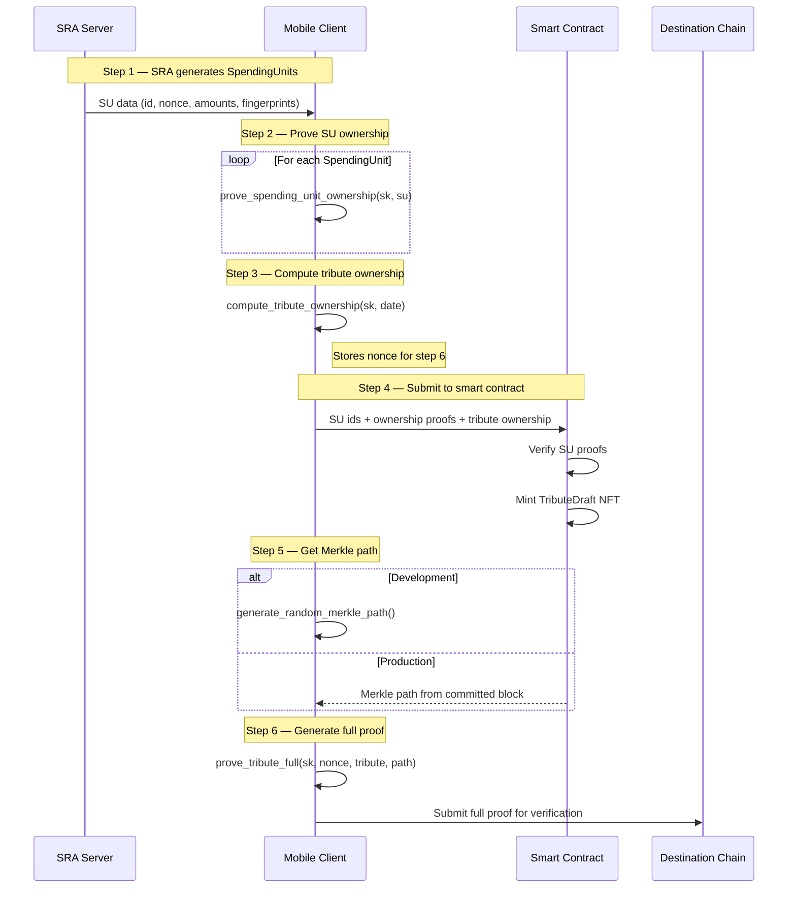
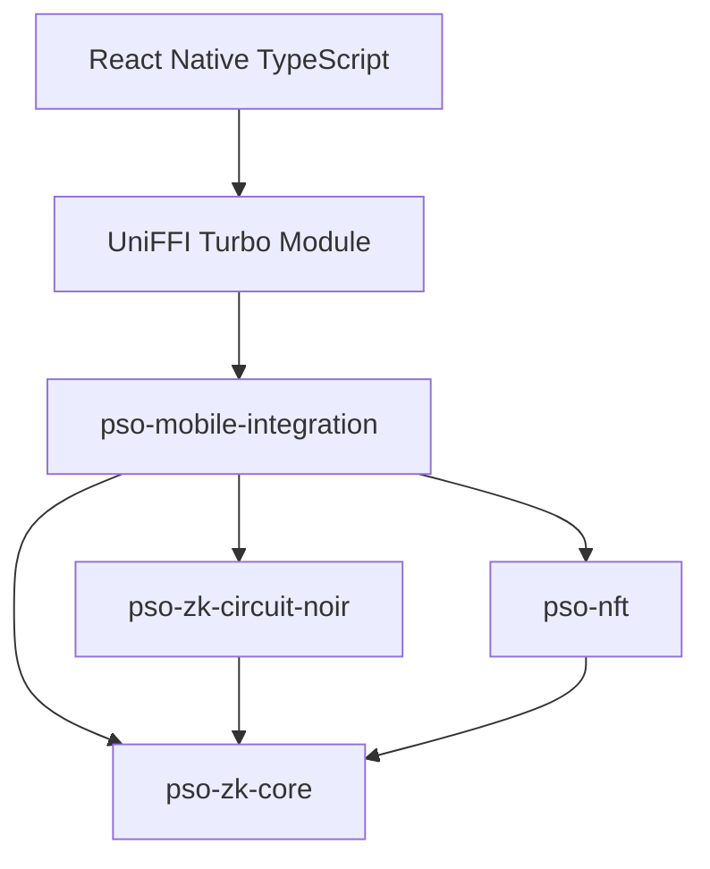

# pso-mobile-integration

Mobile-friendly UniFFI wrapper for PSO ZK proof generation on React Native.

## Overview

This crate provides a thin FFI layer over the PSO ZK proof system,
exposing flat functions with primitive types suitable for
`uniffi-bindgen-react-native` binding generation.

Circuit bytecodes are embedded at compile time. No runtime circuit
loading, no filesystem access, no async — the library is a
deterministic function from inputs to proofs.

## API

| Function | Circuit | Purpose |
|----------|---------|---------|
| `compute_tribute_ownership` | None | Compute ownership hash + tribute ID, generate nonce |
| `prove_spending_unit_ownership` | Ownership | Ownership proof for a SpendingUnit |
| `prove_tribute_ownership` | Ownership | Ownership proof for a TributeDraft |
| `prove_spending_unit_full` | Full | Full proof (ownership + Merkle) for a SpendingUnit |
| `prove_tribute_full` | Full | Full proof (ownership + Merkle) for a TributeDraft |
| `generate_random_merkle_path` | None | Dev-only: random test Merkle path |

## Client Use Case

The mobile wallet participates in a multi-step protocol involving an
SRA server, an on-chain smart contract, and a destination blockchain:

1. **SRA generates SpendingUnits** — the server creates SU NFTs and
   sends back to the client all data needed to reconstruct ownership
   (nonce, key derivation material, currency and amount data).

2. **Client proves SU ownership** — for each SpendingUnit, the client
   calls `prove_spending_unit_ownership` to generate a ZK proof that
   it controls the SU's secret key without revealing it.

3. **Client computes tribute ownership** — the client calls
   `compute_tribute_ownership` to generate a random nonce, compute the
   ownership hash, and derive the TributeDraft ID. The nonce is stored
   locally for later use.

4. **Client submits to smart contract** — the client invokes the
   on-chain smart contract with the SU IDs, their ownership proofs,
   and the TributeDraft ownership value. The smart contract verifies
   all proofs and mints a TributeDraft NFT with the provided ownership.

5. **Client receives Merkle path** — in development mode, the client
   generates a random Merkle path via `generate_random_merkle_path`.
   In production, it waits for the block to be committed and receives
   the real Merkle tree of NFTs from the blockchain.

6. **Client generates full proof** — using the stored nonce from step 3
   and the Merkle path from step 5, the client calls
   `prove_tribute_full` to generate a full ZK proof (ownership +
   Merkle inclusion). This proof is submitted to a destination
   blockchain network for verification.



## Data Types

All inputs and outputs use FFI-safe primitives:

| Concept | FFI Type | Format |
|---------|----------|--------|
| Field element | `Vec<u8>` | 32 bytes, little-endian BN254 scalar |
| Date | `u32` | YYYYMMDD (e.g., 20260305) |
| Currency | `u16` | ISO 4217 numeric code (e.g., 978 = EUR) |
| Amount | `u64` | Integer representation |
| Merkle index | `u8` | 0 = Skip, 1 = Left, 2 = Right |

## Features

| Feature | Description |
|---------|-------------|
| (default) | Production API: 5 proof/compute functions |
| `dev-tools` | Adds `generate_random_merkle_path()` for testing |

Build variants:

```sh
# Production build
cargo build --release --target aarch64-apple-ios

# Development build with test helpers
cargo build --release --target aarch64-apple-ios --features dev-tools
```

## Building for Mobile

### Prerequisites

- Rust toolchain with mobile targets:
  ```sh
  rustup target add aarch64-apple-ios aarch64-apple-ios-sim
  rustup target add aarch64-linux-android x86_64-linux-android
  ```
- Android NDK (for Android targets)

### iOS

```sh
cargo build --release --target aarch64-apple-ios
cargo run --bin uniffi-bindgen-mobile -- generate \
    --library target/aarch64-apple-ios/release/libpso_mobile_integration.a \
    --language swift \
    --out-dir ./bindings/swift
```

### Android

```sh
cargo ndk -t arm64-v8a build --release
cargo run --bin uniffi-bindgen-mobile -- generate \
    --library target/aarch64-linux-android/release/libpso_mobile_integration.so \
    --language kotlin \
    --out-dir ./bindings/kotlin
```

## Architecture



The mobile crate is a leaf dependency — nothing depends on it.
All proof logic delegates to existing workspace crates.
